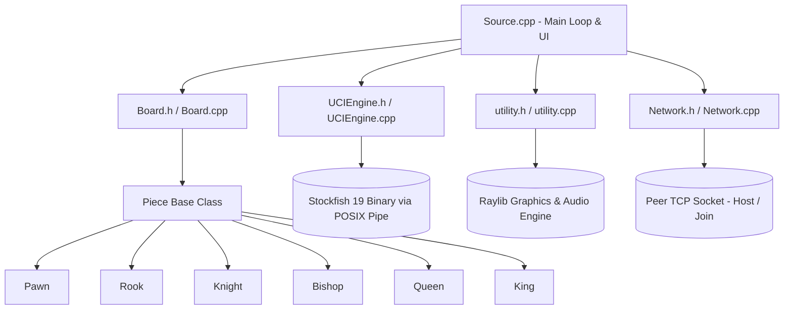

# ♟️ Chess Engine & Interactive Raylib GUI

A high-performance, feature-rich desktop Chess application and engine written in modern **C++17** and rendered with **Raylib 5.0**. Built with clean Object-Oriented Programming (OOP) design, it features an authentic **Chess.com**-inspired user interface, **Stockfish 19 UCI** engine integration, real-time evaluation bar, complete sound effects, customizable board themes, clocks, move review scrubbing, and full international chess rules.

---

## 🌟 Key Features

### 🎨 Chess.com Inspired Experience
- **Square Highlights**: Origin and arrival squares highlighted in authentic yellow/olive tints with glowing perimeter accent lines.
- **Opponent Move Checking**:
  - Live opponent move badge on player cards (e.g. `[ Opponent: 12... exd4 ]`). Click to inspect.
  - Sidebar banner detailing the exact move in algebraic coordinates: `Opponent Played: 12... exd4 (e7 -> d4)`.
  - Press `L` anytime to spotlight the opponent's move on the board.
- **Move Review & Replay Scrubbing**:
  - Scrub backwards and forwards through moves non-destructively using `|<`, `<`, `>`, `>|` or `Left` / `Right` Arrow keys.
  - Interactive move table with standard algebraic notation (SAN) and auto-scroll.
  - Pulsing `LIVE PLAY` / `MOVE X` status badge. Click to immediately snap back to live play.
- **Board Themes**: 4 sleek themes togglable via the `Theme` button or `T`/`N` hotkeys:
  - Chess.com Green
  - Modern Dark Mode
  - Tournament Wood
  - Ocean Blue
- **Tactical Annotations**: Right-click and drag to draw arrows or right-click to highlight candidate squares.
- **Move Hints**: Subtle target dots for legal moves and rings for capture squares.
- **King Check Distress Glow**: Pulsing red radial gradient when a king is in check.
- **Material Advantage & Captured Pieces**: Real-time counter and piece icons on player cards.

### 🤖 Stockfish 19 UCI Engine Integration
- **Direct Process Pipe Communication**: Bidirectional asynchronous communication with Stockfish using the official UCI protocol.
- **6 Calibrated Bot Difficulties**:
  1. **Beginner Bot** (Rating ~800, Internal AI) — Friendly, plays random legal moves.
  2. **Stockfish Casual** (Rating ~1350) — Scaled Elo for club beginners.
  3. **Stockfish Intermediate** (Rating ~1600) — Solid tactical play.
  4. **Stockfish Advanced** (Rating ~2000) — Tournament-grade strength.
  5. **Stockfish Master** (Rating ~2400) — FIDE Master level.
  6. **Stockfish Grandmaster** (Rating ~3500+ Max) — Uncapped full NNUE depth.
- **Live Evaluation Bar**: Vertical eval bar beside the board showing real-time numerical and visual pawn advantage calculated by Stockfish.
- **Underpromotions Supported**: Executes Knight, Bishop, and Rook promotions when recommended by the engine.
- **Smart Draw Acceptance**: Evaluates position before accepting human draw requests.

### 🔊 Complete Sound Effects Suite
Full set of high-fidelity audio triggers:
- `game-start`: Match initiated
- `move-self`: Player move
- `move-opponent`: Opponent/Bot move
- `capture`: Piece captured
- `castle`: Kingside or queenside castling
- `promote`: Pawn promotion
- `move-check`: Check delivered
- `game-end`: Checkmate or draw
- `illegal`: Illegal move attempt or declined draw
- `tenseconds`: Low time warning (<= 10 seconds remaining)
- `premove`: Moving during opponent's turn

### ⏱️ Time Controls & Game Modes
- **Game Modes**:
  - **Play vs Bot**: Select your color (White or Black), choose from 6 bot tiers, and select a time control.
  - **Pass & Play (2 Players)**: Local two-player game with optional board flipping.
  - **Play Online with Friends**: Direct peer-to-peer online play over TCP — see [Playing Online](#-playing-online-with-friends) below.
  - **Load Saved Game**: Resume saved matches instantly.
- **Time Controls**: 3 min (Bullet), 5 min (Blitz), 10 min (Rapid), 15 min (Classical), or Untimed.

### 🌐 Playing Online with Friends
- **Host or Join**: One player picks "Host a Game" (choosing color + time control), the other picks "Join a Game" and enters the host's IP address (`ip` or `ip:port`).
- **Direct peer-to-peer TCP**, default port `5455` — no account, matchmaking server, or internet service required.
- **Same network**: works immediately once one player shares their LAN IP (shown on the "Waiting for Opponent" screen).
- **Different networks**: the host needs to forward port 5455 (TCP) to their machine on their router, or both players can put their machines on the same virtual LAN with a tool like [Tailscale](https://tailscale.com) or Hamachi and use that IP instead.
- **In-match**: moves, resignations, and draw offers/acceptances sync live; Undo/Redo and mid-match "New Game" are disabled online since they'd desync the two boards. A dropped connection ends the game with a clear message on the other side.

### ⚙️ Full Chess Rules Implementation
- **Castling**: Kingside (`O-O`) and Queenside (`O-O-O`), with complete path-clear and check-validation rules.
- **En Passant**: Fully supported with correct ply tracking.
- **Pawn Promotion**: Interactive modal for Queen, Rook, Bishop, or Knight.
- **Checkmate & Stalemate**: Automatic detection and Game Over modal with "Play Again", "Review Board", and "Main Menu" options.
- **Mutual Draw & Resign**: Available in both 2-player and bot modes.
- **Smart Undo / Redo**: `Ctrl+Z` and `Ctrl+Y` (steps 2 plies in bot mode so you stay on your turn).
- **Save & Load**: Persistent match saving with `hasMoved` state preservation.

---

## 🏗️ System Architecture



---

## ⌨️ Controls & Keyboard Shortcuts

| Shortcut | Action |
| :--- | :--- |
| **Left Click / Drag** | Select and move pieces / Click buttons |
| **Right Click + Drag** | Draw tactical arrows |
| **Right Click Square** | Highlight/unhighlight candidate square |
| **Left Arrow / Right Arrow** | Step 1 move backward / forward in review mode |
| **Home / End** | Jump to start of game / snap to live position |
| **L** | Spotlight & inspect opponent's last move |
| **Esc** | Return to live game / close modal / open exit menu |
| **R** | Flip board 180° |
| **T / N** | Cycle board theme (Green, Dark, Wood, Blue) |
| **D** | Offer or claim draw |
| **Ctrl + Z** | Undo move |
| **Ctrl + Y** | Redo move |
| **F10** | Toggle maximized window |
| **F11** | Toggle fullscreen |
| **H** | Display hotkeys reminder banner |

---

## 🚀 Building & Running

### Prerequisites

- **CMake** 3.16+
- **C++17 Compiler** (Clang, GCC, or Apple Clang)
- **Raylib** 4.5+ or 5.0+
- *(Optional)* **Stockfish** (e.g. `brew install stockfish` on macOS)
- Online play and the Stockfish integration both use POSIX sockets/pipes, so they build on macOS and Linux; on Windows, build under WSL for those features.

#### macOS
```bash
brew install cmake raylib stockfish
```

#### Ubuntu / Debian
```bash
sudo apt update
sudo apt install build-essential cmake libraylib-dev stockfish
```

#### Windows
Install Raylib via vcpkg or direct installer, and CMake.

---

### Compilation

```bash
# 1. Clone repository
git clone https://github.com/krishna247-hash/Chess-Engine.git
cd Chess-Engine

# 2. Configure build
mkdir build && cd build
cmake ..

# 3. Build executable
cmake --build .

# 4. Launch game
./ChessGame
```

---

## 📁 Repository Structure

```
.
├── CMakeLists.txt          # CMake build configuration
├── README.md               # Project documentation
├── Source.cpp              # Application entry point, rendering loops, and HUD
├── Board.h / Board.cpp     # Board representation, move validation, snapshotting
├── Piece.h / Piece.cpp     # Base class for chess pieces
├── Pawn.h / Pawn.cpp       # Pawn mechanics & promotion triggers
├── Rook.h / Rook.cpp       # Rook movement & castling rights
├── Knight.h / Knight.cpp   # Knight L-shape moves
├── Bishop.h / Bishop.cpp   # Bishop diagonal moves
├── Queen.h / Queen.cpp     # Queen moves
├── King.h / King.cpp       # King moves, check detection, and castling
├── UCIEngine.h / .cpp      # Stockfish 19 UCI protocol communication
├── utility.h / utility.cpp # Virtual screen scaler, UI buttons, sound player, online setup screens
├── Network.h / Network.cpp # Peer-to-peer TCP session for online play (host/join, moves, resign, draw)
├── PNGs/                   # High-resolution piece textures
└── sounds/                 # Chess.com audio files (.mp3 and .wav)
```

---

## 📜 License
Distributed under the MIT License. Open source and free for educational and recreational use.
